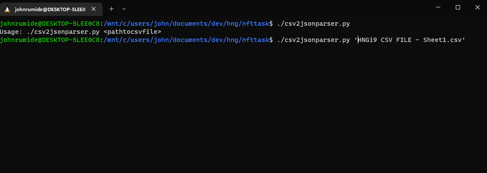

# HNG NFT CHIP PROJECT

> A python script to convert nft data in a csv file to CHIP-0007 json compatible files

## Table of Contents
* [General Info](#general-information)
* [Technologies Used](#technologies-used)
* [Features](#features)
* [Screenshots](#screenshots)
* [Setup](#setup)
* [Usage](#usage)
* [Example](#example)
* [Project Status](#project-status)
* [Acknowledgements](#acknowledgements)
* [Contact](#contact)

## General Information
- Purpose: Converts NFT data ina csv format to CHIP-0007 Json compatible files 

## Technologies Used
- Python - version 3.10
- Ubuntu - version 20.10

## Features
List the ready features here:
- Converts NFT data in a Csv file to CHIP-0007 json compatible file
- Hashes the Json file with the sha256 hashing algorithm
- Saves the hash and the nft data in a csv


## Screenshots



## Setup
Install python
https://www.python.org/downloads/
Or if you use linux run
```
$ sudo apt-get update
$ sudo apt-get python3
```
Clone the repository
```$ git clone https://github.com/codestronomer/HNG-NFT-Team-Task/```

## Usage
Run shell script, pass in one argument (path to csv file)

```bash
./csv2jsonparser.py <pathtocsvfile>
```

### Example

```bash
./csv2jsonparser.py "csv/HNGi9 CSV FILE - Sheet1.csv"
```

Here is the json file with the default values:

```jsonc
{
    "format": "CHIP-0007",
    "name": "Pikachu",
    "description": "Electric-type Pokémon with stretchy cheeks",
    "minting_tool": "SuperMinter/2.5.2",
    "sensitive_content": false,
    "series_number": 0,
    "series_total": 0,
    "attributes": [],
    "collection": {
        "name": "Example Pokémon Collection",
        "id": "e43fcfe6-1d5c-4d6e-82da-5de3aa8b3b57",
        "attributes": [
            {
                "type": "description",
                "value": "Example Pokémon Collection is the best Pokémon collection. Get yours today!"
            },
            {
                "type": "icon",
                "value": "https://examplepokemoncollection.com/image/icon.png"
            },
            {
                "type": "banner",
                "value": "https://examplepokemoncollection.com/image/banner.png"
            },
            {
                "type": "twitter",
                "value": "ExamplePokemonCollection"
            },
            {
                "type": "website",
                "value": "https://examplepokemoncollection.com/"
            }
        ]
    },
    "data": {}
}
```

## Project Status
Project is: _complete_


## Acknowledgements
Give credit here.
- This project was inspired by HNG I9 INTERNSHIP

## Contact
Created by [John Rumide](https://www.github.com/codestronomer) - feel free to contact me!
#### Email: Johnrumide6@gmail.com
